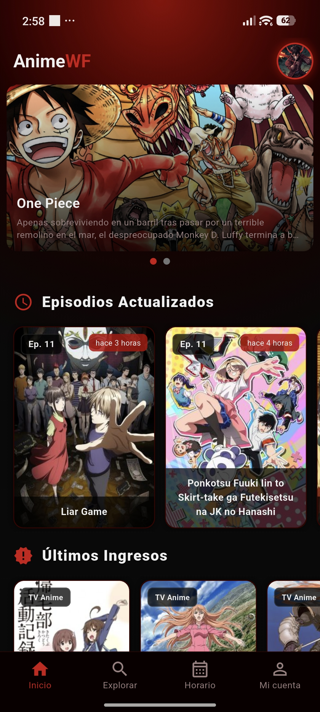
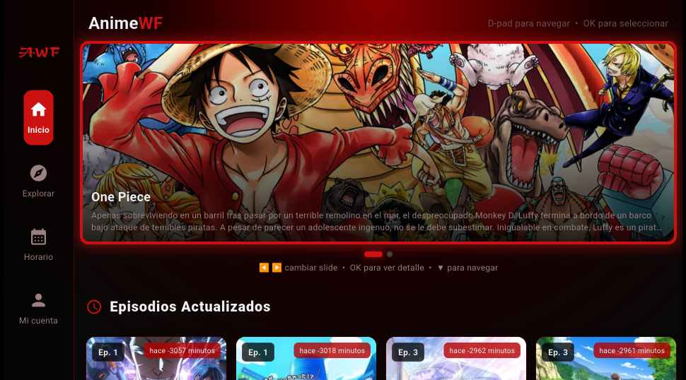

<!-- ╔═══════════════════════════════════════════════════════════════════════╗
     ║   ✏️  EDITA SOLO AQUÍ — DATOS DE LA VERSIÓN                             ║
     ║                                                                         ║
     ║   Cuando subas un nuevo APK, actualiza ÚNICAMENTE este bloque.          ║
     ║   La versión aparece 3 veces dentro de esta zona (y en ninguna          ║
     ║   otra parte del README):                                               ║
     ║     1️⃣  En el badge rojo de «Descargar APK»                             ║
     ║     2️⃣  En la tabla de datos                                            ║
     ║     3️⃣  En el nombre del archivo del enlace directo al APK             ║
     ║   El resto del documento no contiene números de versión.                ║
     ╚═══════════════════════════════════════════════════════════════════════╝ -->

<!-- 💡 Tip: descarga esta imagen y guárdala como "banner.png" en tu repo,
     luego cambia el src a "banner.png" para no depender de URLs externas -->

# 🎌 AnimeWF
### *Tu anime, sin límites*

App Android gratuita para ver anime actualizado, construida con Flutter.

<!-- ── ⬇️ Badges de la versión (edítalos aquí) ── -->

<!-- ── ⬇️ Tabla de datos de la versión (edítala aquí) ── -->
| 📦 Versión | 💾 Tamaño | 🤖 Sistema | 📺 Código Downloader (TV) | 📥 APK directo |
|:----------:|:---------:|:----------:|:-------------------------:|:--------------:|
| **v2.1.0** | 67.5 MB   | Android 5.0+ / TV | **6731463** | [Descargar](https://raw.githubusercontent.com/AnimeWF/AnimeWF-App/main/APK/AnimeWF_2.1.0.apk) |

<!-- ── ️ Novedades de esta versión (edítalas aquí) ── -->
### 🆕 Novedades de esta versión

- 📺 Soporte oficial para Android TV
- 🔐 Inicio de sesión con Google y sincronización
- 📅 Horario de emisión semanal integrado
- ⚡ Correcciones de rendimiento y estabilidad

---

## ✨ Características

| | | |
|:---:|:---|:---|
| 🕐 | **Episodios al día** | Los capítulos más recientes apenas se publican |
| 🔍 | **Explorador completo** | Busca por género, temporada o popularidad |
| 📅 | **Horario semanal** | Calendario de estrenos de la semana |
| 🔐 | **Login con Google** | Progreso sincronizado en todos tus dispositivos |
| ⭐ | **Favoritos** | Guarda tu lista y continúa donde te quedaste |
| 🚫 | **Sin anuncios** | Cero pop-ups, cero interrupciones |

---

## 📱 Capturas

  <b>Móvil · Android</b> 
  

 

  <b>TV · Android TV</b> 
  

---

## 📥 Cómo instalar

1. **Descarga el APK** desde el badge rojo de arriba o desde la [página oficial](https://animewf.github.io/AnimeWF-App/).
2. **Permite orígenes desconocidos** en *Ajustes → Seguridad → Instalar apps desconocidas*.
3. **Abre el archivo, instala** e inicia sesión con tu cuenta de Google. ¡Listo!

> ⚠️ El APK no se distribuye por la Play Store, por eso Android mostrará un aviso de seguridad la primera vez. Es normal y seguro.

---

## 📺 Android TV

1. Instala la app **Downloader** desde la Play Store de tu TV.
2. Introduce el **código Downloader** que aparece en la tabla superior de este README.
3. Abre AnimeWF, inicia sesión con Google y disfruta en pantalla grande. 🍿

---

## 🛠️ Requisitos

| Requisito | Detalle |
|---|---|
| 🤖 Sistema | Android 5.0 o superior (móvil y TV) |
| 💾 Espacio | Consulta el tamaño actual en la tabla superior |
| 🌐 Fuente de contenido | [animeav1.com](https://animeav1.com) |
| 🔑 Cuenta | Google (opcional, para sincronizar) |

---

## 🌐 Fuente de contenido

Contenido obtenido de [animeav1.com](https://animeav1.com).
Proyecto personal sin fines de lucro.

---

## ⚠️ Disclaimer

> Todo el contenido pertenece a sus respectivos propietarios.
> **AnimeWF no almacena ni distribuye archivos de video.**

---

## 🐛 Reportar un problema

¿Algo no funciona? Abre un [issue](https://github.com/AnimeWF/AnimeWF-App/issues) aquí en el repo y con gusto lo reviso.

---

## 🔗 Enlaces

- 🌐 [Página oficial / descarga](https://animewf.github.io/AnimeWF-App/)
- 🐙 [GitHub @AnimeWF](https://github.com/AnimeWF)

---

Hecho con ❤️ por <a href="https://github.com/AnimeWF">@AnimeWF</a>

